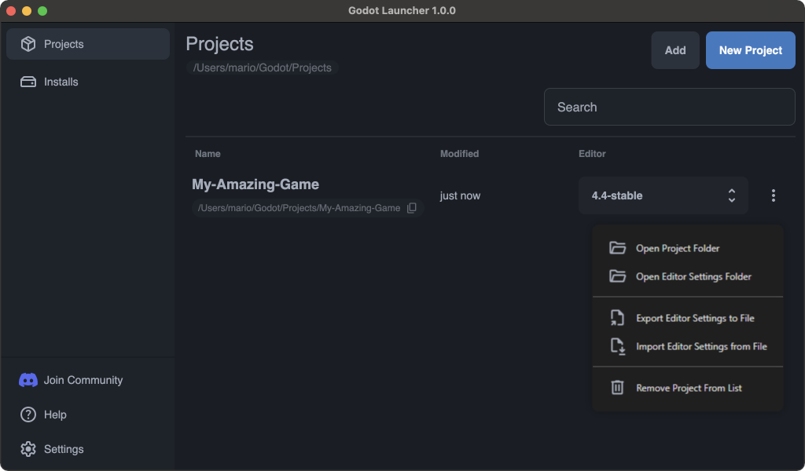

# Godot Launcher

**Godot Launcher** is a streamlined, open-source tool designed to simplify and accelerate your Godot game development workflow. It automates Git initialization, configures VSCode instantly, manages multiple Godot versions seamlessly, and keeps project settings isolated. Quickly prototype ideas, access projects effortlessly from the system tray, and stay up-to-date with automatic updates.

Spend less time configuring your environment and more time creating amazing games.

✅ **Free, Open Source, and Community-Driven.**\
✅ **Cross-platform support, available on Windows, MacOS, and Linux.**\
✅ **Designed for modern Godot workflows, focusing on widely used versions.**

## How to Get Godot Launcher

The best way to get the latest installer is from [the Godot Launcher website](https://godotlauncher.org/download).

## Features

### **Quick Project Setup with Git and VSCode**

- **Instant Git Initialization:** Start a new project with Git automatically initialized, complete with an initial commit—no extra steps required.
- **VSCode Configuration:** Essential paths and settings for VSCode are ready out of the box. Say goodbye to manual editor setups and get to coding faster.

### **Effortless Godot Version Management**

- **Install and Switch Versions:** Seamlessly download and manage multiple Godot Editor versions. Experiment with the latest pre-releases or fall back to stable editions in seconds.
- **Fast Prototyping:** Quickly spin up new ideas using different editor builds. Testing features and previews is a breeze.
- **Modern Godot Support:** The launcher focuses on the most commonly used versions of Godot. Since Godot 3.x adoption is steadily decreasing, custom configurations for it have not been included yet.

### **Per-Project Editor Settings**

- **Isolated Configuration:** Each project maintains its own editor preferences, so you never have to worry about conflicting settings across multiple projects.
- **Easy Import/Export:** Share your editor configurations with teammates or import settings that make sense for different workflows.

### **Quick Edit from System Tray**

- **Seamless Workflow:** Minimize the launcher to your system tray to keep it out of your way while you work.
- **Instant Access:** Jump back into any project with a single click—no need to relaunch or sift through folders.

### **Automatic Updates**

- **Stay Current:** Receive notifications whenever a new version of the launcher is available.
- **One-Click Upgrade:** Simply restart the launcher to apply the update.

### **Cross-Platform Availability**

- **Windows, Mac, and Linux:** You can use the same streamlined workflow on any machine.

### **Free and Open Source**

- **Forever Free:** Godot Launcher is—and always will be—free for everyone.
- **Community-Driven:** Contribute code, suggest features, or report issues. Join a passionate community dedicated to making Godot development smoother for all.

## Community

Join our **[Godot Launcher Discord server](https://discord.gg/Ju9jkFJGvz)** to connect with other users and contributors. Ask questions, share feedback, and stay updated on new releases.

If you’re interested in contributing to Godot Launcher, see the [Contributing](#contributing) section below.

## Versioning

Godot Launcher follows [Semantic Versioning](https://semver.org/) for all releases. Versions are tagged in Git and listed in `package.json` using the `vMAJOR.MINOR.PATCH` format.

- **MAJOR**: breaking changes or updates that require manual migration.
- **MINOR**: backward-compatible improvements and new features.
- **PATCH**: backward-compatible bug fixes and maintenance updates.

Pre-release builds include suffixes like `-beta.1` or `-rc.1`. Document noteworthy changes in `CHANGELOG.md` before cutting a release so downstream users can track what changed.

## Contributing

> [!IMPORTANT]\
> Before opening a new bug report or feature request, please check the [open issues](https://github.com/godotlauncher/launcher/issues) and [closed issues](https://github.com/godotlauncher/launcher/issues?q=is%3Aissue%20state%3Aclosed) first to see if it has already been reported.

We warmly welcome contributions from the community! For detailed guidelines on submitting pull requests, best practices, and more, please see our [contribution guide](CONTRIBUTING.md).

### **Feature Proposals**

For major changes or new features, please open an issue and clearly mark the title as a proposal [here](https://github.com/godotlauncher/launcher/issues).

### **Local Development**

1. **Fork & Clone** this repository to your local machine.
2. Ensure you have **Node.js 22+** installed.
3. Run `npm install` to install all dependencies.
4. Launch the app with `npm run dev`.

Once you have everything running, feel free to open pull requests with your improvements, fixes, or new features.

**We appreciate all contributions!**

## Documentation

Visit the **[official Godot Launcher documentation](https://docs.godotlauncher.org)** for detailed guides, FAQs, and troubleshooting. This documentation is also open-source and maintained by the community in its own [GitHub repository](https://github.com/godotlauncher/launcher-docs).

## License

Godot Launcher is licensed under the [MIT License](./LICENSE.txt). A copy of the license is provided in the repository for your convenience. By contributing to or using this project, you agree to the terms stated therein.

This project also includes third-party assets and libraries, which are licensed under their respective terms. For details, please refer to [`COPYRIGHT.txt`](./COPYRIGHT.txt).
